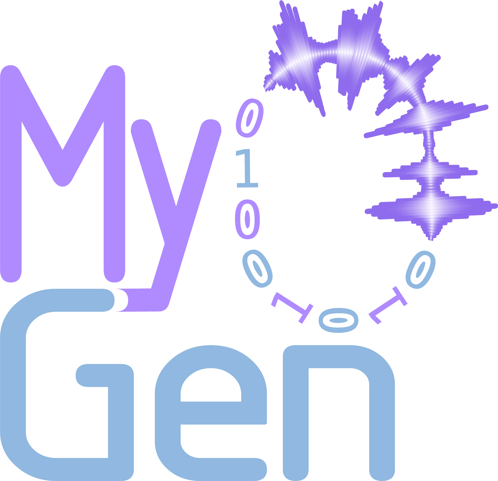

<div align="center">
  

  # MyoGen

  **An extremely fast physiological simulator for electromyography signals**

  [](https://nsquaredlab.github.io/MyoGen/)
  [](https://www.python.org/downloads/)
  [](https://github.com/NsquaredLab/MyoGen)

  [Getting Started](#installation) •
  [Documentation](https://nsquaredlab.github.io/MyoGen/) •
  [Examples](examples/) •
  [Paper](#citation)
</div>

---

MyoGen is a **physiologically-based simulation toolkit** that generates ground-truth EMG signals from motor neurons to surface electrodes. Built for algorithm validation, hypothesis testing, and education.

## Highlights

🧬 **Biophysically accurate neural models** — NEURON-based motor neurons with validated calcium dynamics and membrane properties

🎯 **Ground-truth validation** — Complete access to every motor unit, spike time, and fiber location for rigorous algorithm testing

⚡️ **Vectorized & parallel** — Multi-core CPU processing with NumPy/Numba vectorization for fast computation

🔬 **End-to-end simulation** — From motor unit recruitment to high-density surface EMG in a single framework

📊 **Reproducible science** — Deterministic random seeds and standardized Neo Block outputs for exact replication

🧰 **Comprehensive toolkit** — Surface EMG, intramuscular EMG, force generation, and spinal network modeling

## Installation

**Prerequisites**: Python ≥3.12, Linux/Windows/macOS

> [!IMPORTANT]
> **Windows users**: Install [NEURON 8.2.6](https://github.com/neuronsimulator/nrn/releases/download/8.2.6/nrn-8.2.6.w64-mingw-py-38-39-310-311-312-setup.exe) before running `uv sync`

```bash
# Clone and install
git clone https://github.com/NsquaredLab/MyoGen.git
cd MyoGen
uv sync

# Activate environment
source .venv/bin/activate  # Linux/macOS
.venv\Scripts\activate     # Windows

# Compile NEURON mechanisms (required)
uv run poe setup_myogen
```

> [!TIP]
> Install [UV](https://docs.astral.sh/uv/) first: `curl -LsSf https://astral.sh/uv/install.sh | sh`

**GPU acceleration of convoutions** (optional):
```bash
uv pip install cupy-cuda12x  # 5-10× speedup
```

## Quick Start

Generate surface EMG signals in ~10 lines:

```python
import myogen
from myogen import simulator

myogen.set_random_seed(42)  # Reproducible

# 1. Create motor neuron pool (120 motor units)
thresholds = simulator.generate_mu_recruitment_thresholds(
    n_motor_units=120, model="fuglevand"
)
neurons = simulator.MotorNeuronPool(
    recruitment_thresholds__array=thresholds,
    config_file="alpha_mn_default.yaml"
)

# 2. Simulate spike trains (5 seconds, 15 nA input)
spike_trains = neurons.simulate(duration__ms=5000.0, current__nA=15.0)

# 3. Create muscle and electrode array
muscle = simulator.Muscle(n_motor_units=120, muscle_radius__mm=15.0)
emg = simulator.SurfaceEMG(
    muscle_model=muscle,
    electrode_arrays=[simulator.SurfaceElectrodeArray(num_rows=13, num_cols=5)],
    sampling_frequency__Hz=2048.0
)

# 4. Generate EMG signals
muaps = emg.simulate_muaps(n_jobs=-2)  # Parallel processing
signals = emg.simulate_surface_emg(spike_trains)
```

**Extract results**:

```python
# Access spike times from neuron 5
spike_times = spike_trains.segments[0].spiketrains[5].magnitude

# Get EMG from electrode at row 2, column 2
emg_signal = signals.groups[0].segments[0].analogsignals[0]
electrode_emg = emg_signal[:, 2, 2]

# Calculate RMS amplitude
import numpy as np
rms = np.sqrt(np.mean(electrode_emg.magnitude ** 2))
```

## What Can You Do?

### 🔍 Algorithm Validation
Validate EMG decomposition, force estimation, or conduction velocity algorithms with **known ground truth**. Every motor unit's firing pattern, location, and MUAP shape is accessible.

### 🧪 Research Applications
- **Aging & disease modeling**: Simulate motor unit remodeling, neuropathies
- **Prosthetic control**: Generate training data for myoelectric algorithms
- **Fatigue studies**: Investigate spectral shifts and amplitude modulation

### 📚 Education
Visualize how individual motor units create surface EMG, demonstrate volume conductor effects, and teach signal processing with clean test signals.

## Documentation

📖 **[Read the full documentation](https://nsquaredlab.github.io/MyoGen/)**

- [User Guide](https://nsquaredlab.github.io/MyoGen/neo_blocks_guide.html) — Working with simulation outputs
- [API Reference](https://nsquaredlab.github.io/MyoGen/api/) — Complete class documentation
- [Examples](examples/) — 9 step-by-step tutorials from recruitment to EMG

**Run an example**:
```bash
cd examples/basic
python 05_simulate_surface_emg.py  # Generates surface EMG with visualization
```

## Key Features

### 🧠 Neural Simulation
- **NEURON-based motor neurons** with compartmental models
- **Calcium dynamics** (SK/BK channels) from Powers et al. (2017)
- **Descending drive** via synaptic input or current injection
- **Realistic firing patterns** with physiological ISI variability

### 💪 Muscle Modeling
- **Anatomical fiber distributions** using Voronoi tessellation
- **Motor unit territories** based on glycogen depletion studies
- **Customizable geometry**: fiber density, muscle dimensions, endplate locations

### 📡 EMG Signal Synthesis
- **Multi-layer volume conductor** (bone, muscle, fat, skin) with validated conductivities
- **High-density electrode arrays** with flexible grid configurations
- **Intramuscular recordings** with monopolar and differential configurations
- **Realistic noise modeling** at specified SNR levels

### ⚡️ Performance
- **Vectorized computation** with NumPy for efficient array operations
- **Parallel processing** with joblib (multi-core CPU utilization)
- **JIT compilation** via Numba for performance-critical algorithms
- **GPU acceleration** (optional) via CuPy for 5-10× MUAP speedup

## Data Structures

MyoGen uses **Neo Block** containers following neuroscience standards:

```python
# Spike trains
spike_trains.segments[pool_idx].spiketrains[neuron_idx]

# Surface EMG
surface_emg.groups[array_idx].segments[pool_idx].analogsignals[0][:, row, col]

# Intramuscular EMG
im_emg.segments[pool_idx].analogsignals[0][:, electrode_idx]
```

See the [Neo Blocks Guide](https://nsquaredlab.github.io/MyoGen/neo_blocks_guide.html) for detailed examples.

## Performance

Simulation times on AMD Ryzen 9 5950X (16 cores) + NVIDIA RTX 3090:

| Motor Units | Duration | Grid Size | CPU Time | GPU Time |
|-------------|----------|-----------|----------|----------|
| 50 | 1 s | 13×5 | ~2 min | ~30 s |
| 120 | 5 s | 13×5 | ~15 min | ~3 min |
| 300 | 10 s | 13×5 | ~2 hours | ~20 min |

**Optimization tips**:
- Use `n_jobs=-2` for parallel CPU processing
- Install CuPy for GPU acceleration
- Specify `MUs_to_simulate` to compute only needed motor units

## Validation

MyoGen implements models validated against experimental data:

- **Recruitment**: Fuglevand et al. (1993), De Luca & Contessa (2012)
- **Neural dynamics**: Powers et al. (2017) for calcium-dependent AHP
- **Volume conductor**: Rosenfalck (1969), Dimitrov & Dimitrova (1998)
- **Tissue properties**: Gabriel et al. (1996) for conductivity values

## Citation

If you use MyoGen in your research, please cite:

```bibtex
@software{myogen2025,
  title = {MyoGen: A Physiologically-Based Simulation Toolkit for EMG Signals},
  author = {{NSquared Lab}},
  year = {2025},
  version = {0.4.0},
  url = {https://github.com/NsquaredLab/MyoGen}
}
```

**Paper**: [Coming soon in Nature Neuroscience Technical Reports]

## Contributing

Contributions welcome! See [issues](https://github.com/NsquaredLab/MyoGen/issues) for areas needing help:
- Validation against experimental datasets
- Performance optimizations
- Additional recruitment models
- Documentation improvements

## License

MyoGen is MIT licensed. See [LICENSE](LICENSE) for details.

## Acknowledgments

Built on established neuroscience tools:
- **NEURON** (Hines & Carnevale, 1997) for neural simulation
- **Neo/Elephant** (Garcia et al., 2014) for data structures
- Scientific Python ecosystem: NumPy, SciPy, Matplotlib

---

<div align="center">
  <strong>Developed by NSquared Lab</strong>
  <br>
  <a href="https://nsquaredlab.github.io/MyoGen/">Documentation</a> •
  <a href="https://github.com/NsquaredLab/MyoGen/issues">Issues</a> •
  <a href="https://github.com/NsquaredLab/MyoGen/discussions">Discussions</a>
</div>
