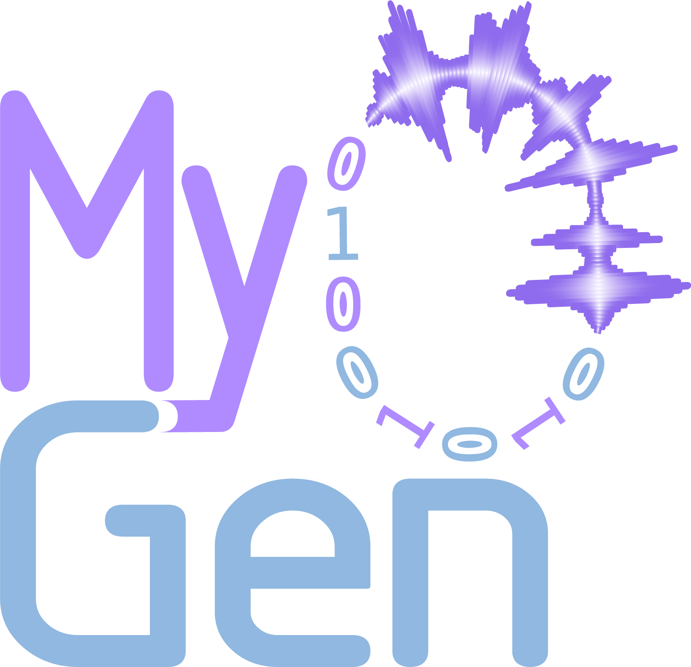

<div align="center" markdown>
<h1></h1>

**The modular and extensible simulation toolkit for neurophysiology**

[Getting Started](getting-started.md){ .md-button .md-button--primary } ·
[Examples](auto_examples/01_basic/index.md){ .md-button } ·
[API Reference](api/index.md){ .md-button }
</div>

## Overview

MyoGen is a **modular and extensible neuromuscular simulation framework** for
generating physiologically grounded motor-unit activity, muscle force, and
surface EMG signals.

It supports end-to-end modeling of the neuromuscular pathway — from descending
neural drive and spinal motor-neuron dynamics to muscle activation and
bioelectric signal formation at the electrode level. MyoGen is designed for
algorithm validation, hypothesis-driven research, and education, providing
configurable building blocks that can be combined and extended independently.

## Highlights

- 🧬 **Biophysically inspired neuron models** — NEURON-based motor neurons with validated calcium dynamics and membrane properties.
- 🎯 **Everything is inspectable** — complete access to every motor unit, spike time, and fiber location for rigorous algorithm testing.
- ⚡️ **Vectorized & parallel** — multi-core CPU processing with NumPy/Numba vectorization for fast computation.
- 🔬 **End-to-end simulation** — from motor-unit recruitment to high-density surface EMG in a single framework.
- 📊 **Reproducible science** — deterministic random seeds and standardized Neo Block outputs for exact replication.
- 📦 **NWB export** — optional export to [Neurodata Without Borders](https://www.nwb.org/) for data sharing via DANDI.
- 🧰 **Comprehensive toolkit** — surface EMG, intramuscular EMG, force generation, and spinal-network modeling.

Head to [Getting Started](getting-started.md) to install MyoGen and run your
first simulation, browse the [Examples](auto_examples/01_basic/index.md)
gallery, or dive into the [API Reference](api/index.md).

## How to cite

If you use MyoGen in your research, please cite:

```bibtex
@article{simpetru_molinari_2026_myogen,
  title   = {MyoGen: Unified Biophysical Modeling of Human Neuromotor Activity and Resulting Signals},
  author  = {S{\^i}mpetru, Raul C. and Molinari, Ricardo G. and Rohlf, Devon R. and
             Batichotti, Rebeka L. and Watanabe, Renato N. and
             Elias, Leonardo A. and Del Vecchio, Alessandro},
  journal = {bioRxiv},
  note    = {preprint},
  year    = {2026},
  doi     = {10.64898/2026.01.01.697284},
  url     = {https://www.biorxiv.org/content/10.64898/2026.01.01.697284}
}
```

## Contributing

Contributions are welcome — see the
[issue tracker](https://github.com/NsquaredLab/MyoGen/issues) to report a bug or
propose a feature.

## License

MyoGen is released under the **AGPL-3.0-or-later** license.
